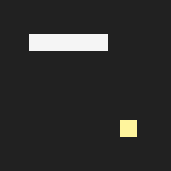

# Snake

Этот проект реализует два ИИ-алгоритма для игры в [змейку](https://ru.wikipedia.org/wiki/Zmejka_(videoigr)).

| Алгоритм | Пример | Средняя длина* | Успешность* |
| :-------: | :-----: | :-------------: | :-----------: |
| [Поиск в графе](#поиск-в-графе) |  | 35.86 | 94% |
| [Обучение с подкреплением](#обучение-с-подкреплением) |  | 29.33 | 50% |

\* **Средняя длина:** Средняя длина змеи до конца игры. Игра заканчивается, когда змея врезается в себя или стену, либо съедает всю еду и достигает максимальной длины. Игровое поле имеет размер 6×6, поэтому максимальная длина — 36. Среднее значение вычисляется по 1000 раундам.

\* **Успешность:** Успех означает, что змея смогла съесть всю еду, достигнуть максимальной длины, не врезаясь в себя или стену. Показатель вычисляется по 1000 раундам.

## Установка

Проект требует Python >= 3.10. Сначала создайте виртуальное окружение:

```
python3 -m venv venv
source venv/bin/activate
```

Установите обязательные зависимости:

```
pip3 install -r requirements.txt
```

Играйте с использованием поиска в графе (добавьте `-h`, чтобы увидеть все поддерживаемые опции):

```
python3 main.py
```

**Опционально:** Чтобы играть, используя обучение с подкреплением, или обучить модель обучения с подкреплением, установите [PyTorch](https://pytorch.org/get-started/locally/) в зависимости от вашего CPU/GPU. Программа поддерживает как CPU, так и GPU. Выполните команду ниже, чтобы играть с обучением с подкреплением:

```
python3 main.py -m rl
```

Предобученная модель обучения с подкреплением доступна [здесь](./rl_model.pt). Выполните команду ниже, чтобы обучить свою модель:

```
python3 rl_train.py
```

## Алгоритмы

Реализованы два алгоритма для игры. Первый алгоритм основан на поиске в графе и предоставляет стратегию на основе правил для различных ситуаций. Второй алгоритм основан на обучении с подкреплением, где змея учится играть методом проб и ошибок, без предварительных знаний.

### Поиск в графе

Алгоритм моделирует сетку как граф, где узлы — это позиции, а ребра соединяют смежные позиции (вверх, вниз, влево, вправо). Алгоритм выбирает следующий ход, используя стратегию:

1. Если змея достаточно длинная, алгоритм ищет [гамильтонов путь](#гамильтонов-путь) от головы змеи до её хвоста. Если путь существует, змея может безопасно двигаться по гамильтонову циклу, чтобы достичь максимальной длины. В противном случае переход к следующему шагу.

2. Алгоритм ищет кратчайший путь от головы змеи до еды. Если путь существует, он временно двигает змею по пути, чтобы съесть еду, и проверяет, есть ли ли безопасный путь от головы змеи до её хвоста после этого. Если да, это означает, что змея может безопасно съесть еду, не попадая в ловушку, и следовать кратчайшему пути к еде. В противном случае переход к следующему шагу.

3. На этом этапе змея не может безопасно съесть еду. Алгоритм ищет [более длинный путь](#более-длинный-путь) от головы змеи до её хвоста, чтобы перестроить сетку и, возможно, создать безопасный путь к еде позже. Если путь к хвосту существует, змея может двигаться по нему. В противном случае переход к следующему шагу.

4. На этом этапе змея не может ни безопасно съесть еду, ни двигаться к своему хвосту. Алгоритм анализирует смежные позиции головы змеи, до которых можно добраться, и движется в сторону позиции, максимально удалённой от еды, стремясь отвести змею от еды и, возможно, освободить место для создания безопасного пути в будущем.

Алгоритм реализован [здесь](./src/agents/graph.py#L27).

#### Гамильтонов путь

[Гамильтонов путь](https://ru.wikipedia.org/wiki/Задача_о_гамильтоновом_цикле) — это путь в графе, который посещает каждую вершину ровно один раз. Гамильтонов цикл — это гамильтонов путь, который является циклом, то есть начинается и заканчивается в одной и той же вершине. В игре в змейку, следуя гамильтонову циклу, гарантируется, что змея посетит все позиции, не попадая в ловушку, и, следовательно, может безопасно съесть всю еду и достичь максимальной длины.

Поиск гамильтонова пути — это задача NP-полной сложности. Однако для небольшой сетки 6×6, с использованием backtracking и [эвристики Уорндорфа](https://ru.wikipedia.org/wiki/Эвристика_Уорндорфа) для направления поиска, можно найти гамильтонов путь за разумное время. Алгоритм ищет гамильтонов путь только тогда, когда змея достаточно длинная, чтобы увеличить вероятность быстрого нахождения такого пути.

#### Более длинный путь

Более длинный путь — это путь, который может быть несколько длиннее кратчайшего пути. Он строится путём вставки поперечных шагов вдоль каждого сегмента пути. Например, если змея должна двигаться вправо, более длинный путь заменяет этот шаг трёхшаговым обходным путём (вниз → вправо → вверх), создавая зигзагообразный узор.

Причина использования более длинного пути вместо кратчайшего — обработка случая, когда голова змеи находится рядом с её хвостом. Это обычно происходит, когда змея становится достаточно длинной. Если змея движется по кратчайшему пути, она прибудет к хвосту на следующем шаге. Хотя игра позволяет змее двигаться в позицию хвоста (поскольку хвост перемещается, когда голова движется вперёд), это может привести к замедлённому движению змеи по фиксированному пути. Используя более длинный путь, змея заполняет пустые позиции около хвоста, прежде чем прибыть туда, освобождая место для будущих ходов.

### Обучение с подкреплением

[Обучение с подкреплением](https://ru.wikipedia.org/wiki/Обучение_с_подкреплением) — это парадигма машинного обучения, где агент учится принимать решения, выполняя действия в окружающей среде, чтобы максимизировать совокупную награду. В этой игре змея — это агент, игровая сетка — окружающая среда, а действия — возможные ходы. Алгоритм обучения использует нейронную сеть для аппроксимации функции ценности действий (Q-функции), которая оценивает ожидаемую совокупную награду за определённое действие в заданном состоянии. Змея учится играть, осматривая различные действия и получая награды на основе результатов (например, положительная награда за съедание еды, отрицательная награда за врезание в себя или стену). Использование нейронных сетей в обучении с подкреплением называется [глубоким обучением с подкреплением](https://en.wikipedia.org/wiki/Deep_reinforcement_learning). Для лучшей сходимости и стабильности процесс обучения применяет технику [Double DQN](https://arxiv.org/abs/1509.06461).

Реализация: [Структура сети](./src/agents/rl.py#L51) | [Инференс](./src/agents/rl.py#L148) | [Обучение](./rl_train.py)

#### Представление состояния

Текущее состояние змеи представлено двумя связанными тензорами:

1. Первый тензор — это 4-канальный тензор 6×6, который подаётся на сверточные слои. 4 канала кодируют: 1) позицию еды, 2) тело змеи, 3) голову змеи и 4) опасные позиции (где игра заканчивается, если змея двинется туда).

2. Второй тензор — это 1D тензор, включающий: 1) текущее направление движения змеи, 2) текущее направление еды относительно головы змеи и 3) расстояние Мэнхэтена между головой змеи и едой.

Выход сверточных слоёв и второй тензор соединяются и подаются на несколько полностью связанных слоёв к выходному слою, который вычисляет Q-значения для каждого возможного действия в текущем состоянии.

#### Пространство действий

Поскольку игра не позволяет змее двигаться в противоположном направлении, пространство действий состоит из трёх действий: повернуть налево, повернуть направо и идти прямо, относительно текущего направления движения змеи. Поэтому выходной слой нейронной сети имеет три выходных элемента, каждый из которых представляет Q-значение для одного из трёх действий.

#### Проектирование наград

Награды, которые агент получает при взаимодействии с окружающей средой, критически важны для обучения эффективного агента. В этой игре функция награды определена следующим образом:

1. Если змея врезается в себя или стену, она получает большую отрицательную награду `-100`.

2. Если змея съедает один кусочек еды, она получает положительную награду `+10`.

3. Если змея достигает максимальной длины, она получает большую положительную награду `+100`.

4. Если змея всё ещё жива, но не съедает еду, она получает малую отрицательную награду `-0.01`. Это стимулирует змею быстро находить еду и заканчивать игру. Отрицательная награда мала, поскольку змея может нужно делать обходные пути, чтобы не попасть в ловушку, и мы не хотим подавлять это поведение.

5. Если змея движется определённое количество шагов, не съедая еду, она получает большую отрицательную награду `-100` и игра заканчивается. Это предотвращает змею от бесконечного бесцелного движения.

## Лицензия

См. файл [LICENSE](./LICENSE) для получения дополнительной информации о правах и ограничениях лицензии.

---

> Это русскоязычная версия [README.md](README.md).
